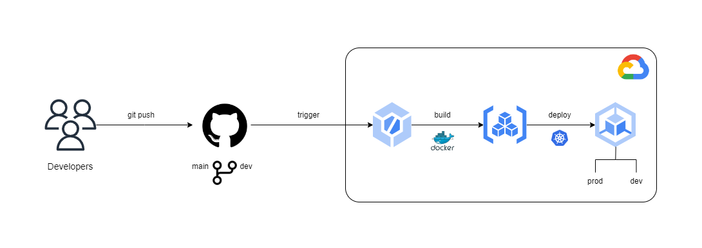

# DevOps project on Google Cloud

> This hands-on project is done during my studying for GCP - PCA certification. The code may contain some bugs.  

 

This is a DevOps CI/CD project deployed on Google Cloud using GCP native tools.    

## Architecture 

You can clone my repository or start from scratch with your own repository and code. 

## Technologies
- Python
- Docker
- Google Code Build
- Google Artifact Registry
- Google Kubernetes Engine 

## Prerequisites 
- Google Cloud account 
- Containerization knowledge

### Clone the repository
`git clone https://github.com/YU88John/gcp-devops-project.git`  
If you decided to clone the repository, you can skip to [Setup GKE section](#Setup-Google-Kubernetes-Engine-cluster).

### Source code and Dockerfile
- <u>Write a simple python code for "Hello World"</u>  
The code(`app.py`) uses a python library called `flask`. We need to download `flask` library in order to run the code. We will simply add `flask` inside `requirements.txt` so that it can be referenced during `docker build`    

- <u>Create a Dockerfile</u>  
We will use `python:3.8-slim-buster` base image. You can use an image of your choice which has the same version. We will copy the previous `requirements.txt` into our Dockerfile working directory, and install it with `pip3 install`.     

- <u>Build and run the image locally</u>  
If you do not have local Docker Desktop setup, please proceed the steps in this <a href="https://docs.docker.com/desktop/install/windows-install/">documentation</a>.  
Run the following commands to build and run docker image locally.  
    - `docker build -t hello-world .` 
    - Check your image - `docker images`
    - Run the built image - `docker run -p 5001:5000 hello-world` 
    - Access the application on browser via `localhost:5001` 

### Setup Google Kubernetes Engine cluster 
If you do not have GCP account yet, please <a href="https://cloud.google.com/free">create</a> it for free. 

- <u>Enable `Kubernetes Engine API`</u>  
In GCP console:   
`API and services > Enable APIs and services > Kubernetes Engine API > Enable `   
This will take you to GKE Homepage.    

- <u>Create GKE cluster</u>

    You can create the cluster in one of two ways. 
1. Console  
There are two creation modes for GKE: `standard` and `autopilot`. For this project, we will create a `standard` cluster.  
**Cluster specifications:**  
    - Name: `gcp-devops`
    - Zonal: `us-central1-c`
    - Machine type: `e2-medium` 
    - Boot disk size: `20 GB (PD-Standard)`  

    Accept the default values for other fields and click on `Create`. It will take `5-10 mins` to create the cluster.   

2. Cloud Shell command line  
Paste the following command  
`gcloud container clusters create "gcp-devops" --zone "us-west1-a" --machine-type "e2-medium" --disk-type "pd-standard" --disk-size "20" --num-nodes "2" --node-locations "us-west1-a"`  
When prompted, click `Authorize`
 
 

- <u>Setup `kubectl` in Cloud Shell </u>  
Open the Cloud Shell in your GCP console. Type the following command; replacing `<YOUR_PROJECT_NAME>`:  
`gcloud container clusters get-credentials gcp-devops --region us-central1 --project <YOUR_PROJECT_NAME>`  
Click `Authorize`. Verify by running `kubectl get namespace`. This will list all the namespaces available in your cluster which is `gcp-devops`.    
*Note:* You may need to setup `kubectl` again, if the current Cloud Shell environment is terminated and a new one is launched.    

- <u>Create Namespace</u>  
For isolation purposes, we will not use the `default` namespace. We will create a new namespace called `devops-prod`.  
`kubectl create namespace devops-prod`  
`kubectl get namespaces` - You will see your new namespace    
You can test deploy  into that namespace.  
`kubectl apply -f gke-deployment.yaml -n devops-prod`
   
Check the deployment.  
`kubectl get deployments -n devops-prod`

### Setup Cloud Build
Cloud Build is a CI/CD tool which can be used to build, test, and deploy artifacts to various services. You can read more <a href="https://cloud.google.com/build/docs/overview">here</a>.
- <u>Enable Cloud Build API</u>  
In the GCP console:  
`API and services > Enable APIs and services > Cloud Build API > Enable `  

- <u>Link GitHub repository for trigger</u>  
In the CloudBuild console:  
`Triggers > Connect repository > GitHub`  
This will redirect to authenticate your repository and install Cloud Build in your GitHub account. Choose your source repository for installation. Switch back to the console and connect to your repository. We will create a trigger later. 

    For Cloud Build to perform an action on every trigger, we need a configuration file. For this project, we will use `cloudbuild.yaml` which I already included in <a href="https://github.com/YU88John/gcp-devops-project">my repository</a>.  
    In the Cloud Build console:  
    `Repository > Add trigger`
    - Region: `global(non-regional)`
    - Event: `push to a branch`
    - Repository: `<YOUR_ADDED_REPO>`
    - Branch: `^main$` 
    - Configuration: `Cloud Build configuration file`
      - file location: `/cloudbuild.yaml`

- <u>Test the CI/CD</u>  
The trigger is setup and the kubernetes cluster is already up and running. Now, we will test if our CI/CD service is working as expected.  
Edit your `app.py` context to something such as `Hello World 123`. Commit the changes to the `main` branch.  
    - `git add app.py` 
    - `git commit -m "edit app.py"`
    - `git push origin main` 
 

    Ensure the deployment is successful via Cloud Build console. If something fails, check the steps, and check`gke-deployment.yaml` and `cloudbuild.yaml` files. Some of these bugs may due to naming conflicts. 

### Split production and development 
As a good DevOps practice, it is a "must" to have separate environments. By doing this, we can ensure that there is no unintended deployment to the production environment. The ideal method is to separate clusters for "prod" and "dev" environments.  
However, since this is not the real production, we will separate `namespaces` only, to minimize resources and costs.  

Since steps are the same as [Cloud Build](#Setup-Cloud-Build) section, please follow them. The files for devlopment envrionment are included in `dev` branch of this repository. Afterwards, leave other parts the same but do the following.   

Create new branch in your repository:
 - `git branch dev`
 - `git checkout -b dev`
 

In Cloud Shell `kubectl` environment:
 - `kubectl create namespace gcp-devops-dev`
 

While creating trigger:
 - Branch: `^dev$`

 Test

